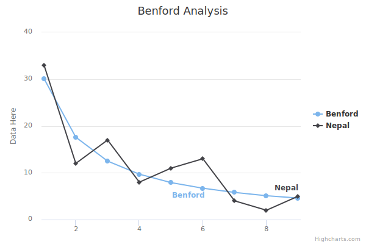

# Benford's Law
Benford's Law analysis of the COVID cases. 

- [https://en.wikipedia.org/wiki/Benford%27s_law](https://en.wikipedia.org/wiki/Benford's_law)

# Usage 

You can quickly do the analysis of the COVID reported data here.

- https://paulospx.github.io/Benford/

This demo uses:

- Bootstrap4
- High Charts
- https://github.com/owid/covid-19-data/tree/master/public/data/ as Data Source

# License

MIT

